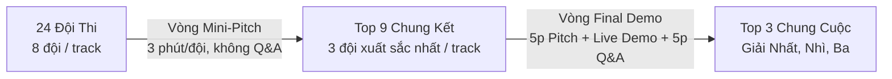

# GLOBAL HACKATHON 2026 - SỔ TAY SINH VIÊN (STUDENT HANDBOOK)
> **Chủ đề trung tâm**: *The New Era of Education: Driving the Future Learning With AI*  
> *(Kỷ nguyên mới của Giáo dục: Thúc đẩy tương lai học tập cùng Trí tuệ Nhân tạo)*

---

## 📌 MỤC LỤC TỔNG QUAN
- **Phần 01**: Về Tổ chức Lead The Change
- **Phần 02**: Về Global Hackathon 2026
- **Phần 03**: Chủ đề & Định hướng chương trình (Programme Theme)
- **Phần 04**: Lịch trình chi tiết 48 giờ (Programme Timeline)
- **Phần 05**: Thể thức các vòng thi (Round Format)
- **Phần 06**: Tiêu chí chấm điểm chi tiết (Marking Criteria)
- **Phần 07**: Quy chế thi đấu & Liêm chính học thuật (Rules & Regulations)
- **Phần 08**: Giải đáp câu hỏi thường gặp (FAQs)
- **Phần 09**: Thông tin liên hệ Ban tổ chức

---

## TRANG BÌA & THÔNG TIN CHUNG (Trang 1 - 2)

* **Tên cuộc thi**: **GLOBAL HACKATHON 2026**
* **Thông điệp chủ đạo**: *The New Era of Education: Driving the Future Learning With AI*
* **Thời gian**: Ngày 15/09/2026 – 17/09/2026
* **Địa điểm**: Khuôn viên Đại học FPT TP.HCM (Campus Khu Công nghệ cao, TP. Thủ Đức, TP.HCM)
* **Đơn vị tổ chức**: **Lead The Change** & **InnoLab Asia**
* **Đơn vị đồng tổ chức**: **FPT Education** & **Republic Polytechnic (Singapore)**
* **Đơn vị bảo trợ & đồng hành**: **Digital Youth Network**
* **Tài liệu đề bài (Challenge Briefing)**: [Canva Presentation Link](https://canva.link/b2olfvjjffcqiou)
* **Quy mô người tham gia**: 120 sinh viên xuất sắc đến từ Việt Nam và Singapore, được chia thành **24 đội thi đa văn hóa** (Cross-cultural teams).
* **Triết lý cốt lõi (Core Philosophy)**: *"Học qua hành (Learning by doing)"* – Thấu hiểu các bài toán thực tế, tìm ra insight người dùng, kiến tạo ý tưởng, xây dựng & kiểm thử nguyên mẫu với người dùng thật, nhận phản hồi chuyên sâu từ các chuyên gia/mentor và liên tục lặp lại để hoàn thiện giải pháp.
* **Châm ngôn hành động (Motto)**: 
  > *"Build responsibly. Test with real users. Learn across cultures. Shape the future of learning."*  
  > *(Xây dựng có trách nhiệm. Kiểm thử với người dùng thật. Học hỏi đa văn hóa. Định hình tương lai học tập.)*

---

## PHẦN 1: VỀ LEAD THE CHANGE (Trang 4)
* **Lead The Change**: Là tổ chức giáo dục tạo tác động xã hội thành lập từ năm 2016.
* **Tầm nhìn**: Đào tạo, bồi dưỡng và trao quyền cho thế hệ lãnh đạo kiến tạo sự thay đổi tiếp theo thông qua **Giáo dục (Education)**, **Đổi mới sáng tạo (Innovation)** và **Hợp tác (Collaboration)** vì một tương lai phát triển bền vững.
* **Hồ sơ năng lực (Track Record)**:
  * Hơn 9 năm kinh nghiệm tổ chức các chương trình đào tạo quốc tế.
  * 300+ sự kiện, hội thảo chuyên môn.
  * Mạng lưới hơn 500+ chuyên gia, mentor, doanh nhân trong và ngoài nước.
  * Truyền cảm hứng và tác động đến hơn 20.000+ sinh viên, thanh niên.
  * Hợp tác với hơn 50+ đối tác doanh nghiệp và trường đại học toàn cầu.

---

## PHẦN 2: VỀ GLOBAL HACKATHON 2026 (Trang 5)
* **Quy mô tổ chức**: 
  * 3 ngày Hackathon AI thực chiến.
  * 120 sinh viên Việt Nam và Singapore.
  * 24 đội thi đa văn hóa (ghép cặp sinh viên hai nước).
  * 3 Track thử thách trong lĩnh vực EdTech.
  * 48 giờ chạy nước rút xây dựng sản phẩm (Build Sprint).
* **3 Trụ cột của chương trình (Program Pillars)**:
  1. **Đồng kiến tạo liên văn hóa (Cross-Cultural Co-Creation)**: Học hỏi, chia sẻ góc nhìn và làm việc nhóm hiệu quả giữa các nền văn hóa.
  2. **Đổi mới sáng tạo lấy con người làm trung tâm (Human-Centered Innovation)**: Bắt đầu từ nỗi đau và nhu cầu có thật của người học, không làm công nghệ viển vông.
  3. **Tạo nguyên mẫu với trợ lực AI (AI-Enabled Prototyping)**: Ứng dụng sức mạnh của các mô hình AI để hiện thực hóa sản phẩm nhanh chóng và có trách nhiệm.
* **Trải nghiệm 3 ngày**:
  * **Day 1 (15/09)**: *Khởi động & Khám phá (Kickoff & Explore)* – Khai mạc, làm quen đội nhóm, nắm vững nền tảng sản phẩm AI, tham quan thực tế FPT Software.
  * **Day 2 (16/09)**: *Thiết kế & Xây dựng (Design & Build)* – Tư duy thiết kế (Design Thinking), đào tạo kiến trúc AI, Mentoring Lab & chạy nước rút làm prototype.
  * **Day 3 (17/09)**: *Kiểm thử & Tỏa sáng (Test & Showcase)* – Kiểm thử với người dùng thật, vòng Mini-Pitch, Vòng Chung kết Final Demo, Lễ trao giải và Dạ tiệc Gala Dinner.

---

## PHẦN 3: CHỦ ĐỀ & ĐỊNH HƯỚNG CHƯƠNG TRÌNH (Trang 6 - 7)

### 1. Câu hỏi định hướng trung tâm
> *"Làm thế nào chúng ta có thể ứng dụng AI để tạo ra những trải nghiệm học tập tốt hơn, ý nghĩa hơn cho thế hệ sinh viên tiếp theo?"*

### 2. Quy trình 4 bước chuyển hóa (4 Key Process Steps)
1. **Thấu hiểu (Understand)**: Đi sâu vào trải nghiệm thực tế của sinh viên để xác định các nhu cầu học tập cốt lõi.
2. **Tái định hình (Reimagine)**: Đặt câu hỏi công nghệ và AI có thể giải quyết các rào cản và nâng cao năng lực cho người học ra sao.
3. **Xây dựng (Build)**: Chuyển hóa các góc nhìn thành giải pháp EdTech ứng dụng AI và một bản nguyên mẫu (prototype) chạy được.
4. **Xác thực (Validate)**: Thử nghiệm giải pháp trực tiếp với người học thật để thu thập phản hồi và cải tiến.

### 3. Yếu tố Đa văn hóa (Việt Nam $\times$ Singapore)
Tận dụng sự giao thoa góc nhìn giữa sinh viên Việt Nam và Singapore để tạo ra những giải pháp EdTech có tính linh hoạt, khả năng thích ứng cao, mang tính bao trùm và có thể nhân rộng ở nhiều thị trường giáo dục khác nhau.

### 4. 05 Sản phẩm đầu ra kỳ vọng (Expected Deliverables)
1. **User Insight (Insight người dùng)**: Nhu cầu của sinh viên được định nghĩa rõ ràng, cụ thể, có dữ liệu/bằng chứng thực tế chứng minh.
2. **EdTech Solution (Giải pháp EdTech)**: Tuyên ngôn giá trị (Value Proposition) tập trung, trực tiếp giải quyết vấn đề đã nêu.
3. **AI-Enabled Prototype (Nguyên mẫu tích hợp AI)**: Bản prototype hoạt động được, thể hiện tối thiểu **1 luồng trải nghiệm người dùng cốt lõi (Core User Journey)**.
4. **User Validation (Kiểm chứng người dùng)**: Dữ liệu phản hồi thu thập từ học sinh/sinh viên thật kèm minh chứng về các cải tiến sau kiểm thử.
5. **Pitch & Demo (Thuyết trình & Trình diễn)**: Cốt truyện thuyết trình mạch lạc, truyền tải trọn vẹn: Vấn đề $\to$ Giải pháp $\to$ Vai trò của AI $\to$ Tác động tiềm năng.

---

## PHẦN 4: LỊCH TRÌNH CHI TIẾT 48 GIỜ (Trang 8 - 10)

### 🗓️ NGÀY 1: THỨ BA, 15/09/2026 — KHỞI ĐỘNG & KHÁM PHÁ (KICKOFF & EXPLORE)
*Mục tiêu: Thấu hiểu đề bài, xác lập đội thi, chọn track và phân vai trò.*

| Thời gian | Hoạt động | Địa điểm / Chi tiết |
| :--- | :--- | :--- |
| **08:30 – 09:00** | Check-in & Ổn định chỗ ngồi theo đội | Hội trường 404 |
| **09:00 – 10:00** | Lễ Khai mạc, Tổng quan chương trình & **Công bố Đề bài (Challenge Reveal)** | Hội trường 404 |
| **10:00 – 10:30** | Ghép đội chính thức, Chọn Track (tối đa 8 đội/track) & Phân chia vai trò | Hội trường 404 |
| **10:30 – 11:30** | Hoạt động: Thảo luận nhóm định hướng đề bài (Team Brainstorming) | Hội trường 404 |
| **11:30 – 13:00** | Nghỉ trưa & Ăn trưa | Tự do |
| **13:00 – 14:30** | **Workshop #0: "AI Product Journey"** (Quy trình 4 bước làm chủ sản phẩm AI) | Hội trường 404 |
| **15:00 – 17:00** | **Tham quan thực tế FPT Software (Company Visit)** | FPT Software Campus |
| **17:00** | Kết thúc Ngày 1 | Sinh viên nghỉ ngơi chuẩn bị cho Ngày 2 |

* **Đầu ra Ngày 1**: Chốt đội hình, xác nhận track bài toán, phân công vai trò, định hình hướng tiếp cận ban đầu.

---

### 🗓️ NGÀY 2: THỨ TƯ, 16/09/2026 — THIẾT KẾ & XÂY DỰNG (DESIGN & BUILD)
*Mục tiêu: Chuyển bài toán thực tế thành giải pháp AI có nguyên mẫu chạy được.*

| Thời gian | Hoạt động | Địa điểm / Chi tiết |
| :--- | :--- | :--- |
| **08:15 – 08:30** | Điểm danh & Chào buổi sáng | Hội trường 404 |
| **08:30 – 09:45** | **Workshop #1 (Phần 1)**: Design Thinking – Xác định vấn đề lấy người dùng làm trung tâm | Hội trường 404 |
| **09:45 – 10:00** | Nghỉ giải lao (Teabreak) | Sảnh |
| **10:00 – 11:00** | **Workshop #1 (Phần 2)**: Hoàn thiện Problem Statement & Solution Hypothesis | Hội trường 404 |
| **11:00 – 12:00** | **Mentoring Lab #1 & CHECKPOINT #1**: Duyệt Problem Statement Canvas & Solution Hypothesis | Tầng 1 Thư viện (Mỗi đội review 20p) |
| **12:00 – 13:30** | Nghỉ trưa & Ăn trưa | Tự do |
| **13:30 – 14:30** | **Workshop #2**: Ứng dụng AI & Thiết kế Kiến trúc Nguyên mẫu (Prototype Architecture) | Hội trường 404 |
| **14:30 – 15:30** | Hoạt động: **Build Sprint #2** (Dựng luồng logic AI và Prototype) | Tự làm việc nhóm |
| **15:30 – 15:45** | Nghỉ giải lao (Teabreak) | Sảnh |
| **15:45 – 16:45** | **Mentoring Lab #2 & CHECKPOINT #2**: Duyệt AI Logic Flow Diagram & Tiến độ Prototype v1 | Tầng 1 Thư viện (Tech & Biz Mentor) |
| **16:45 – 18:00** | Hoạt động: **Build Sprint #3** (Hoàn thiện Prototype & **Test thử với 3–5 người dùng thật**) | Tự làm việc nhóm |
| **18:00** | Kết thúc Ngày 2 | Tiếp tục tinh chỉnh sản phẩm |

* **Đầu ra Ngày 2**: Bảng Problem Statement Canvas, Target Persona, Insight người dùng, Luồng kiến trúc AI (AI Logic Flow), Prototype v1 và dữ liệu phản hồi sơ bộ.

---

### 🗓️ NGÀY 3: THỨ NĂM, 17/09/2026 — KIỂM THỬ & TỎA SÁNG (TEST & SHOWCASE)
*Mục tiêu: Hoàn thiện nguyên mẫu, Pitching tuyển chọn Top 9 và tranh tài tại Chung kết Final Demo.*

| Thời gian | Hoạt động | Địa điểm / Chi tiết |
| :--- | :--- | :--- |
| **08:15 – 08:30** | Điểm danh & Chào buổi sáng | Hội trường 404 |
| **08:30 – 09:30** | **Workshop #3**: Kỹ năng Pitching & Thuyết trình câu chuyện sản phẩm | Hội trường 404 |
| **09:30 – 10:30** | **Mentoring Lab #3 & CHECKPOINT #3**: Tổng duyệt Slide (Dry-run) & Demo Preview | Tầng 1 Thư viện |
| **10:30 – 10:40** | Nghỉ giải lao (Teabreak) | Sảnh |
| **10:40 – 11:30** | **VÒNG MINI-PITCH (24 Đội $\to$ Chọn Top 9 Đội)** | Tầng 1 Thư viện (3 phòng/track song song) |
| **11:30 – 11:40** | **CÔNG BỐ TOP 9 VÀO CHUNG KẾT** & Hướng dẫn kỹ thuật | Hội trường 404 |
| **11:40 – 13:30** | Nghỉ trưa / Top 9 nộp slide bản cuối & kiểm tra kỹ thuật | Tự do |
| **13:30 – 14:35** | Khai mạc phiên Chung kết Demo Day & Công bố thể lệ | Hội trường 404 |
| **14:35 – 16:35** | **THE FINAL PITCH & DEMO SHOWCASE (Top 9 thi tài)** | Hội trường 404 |
| **16:35 – 17:10** | Lễ Trao giải, Trao chứng nhận & Tổng kết bế mạc | Hội trường 404 |
| **17:10 – 19:10** | **Dạ tiệc Gala Dinner** | Sảnh A (Hall A) |
| **19:10** | Bế mạc trọn vẹn Global Hackathon 2026 | |

* **Đầu ra Ngày 3**: Prototype v2 hoàn thiện, Kết quả kiểm chứng người dùng, Pitch Deck chuẩn chỉnh, Mini-Pitch (24 đội) và Final Demo trực tiếp (Top 9).

---

## PHẦN 5: HÀNH TRÌNH 48 GIỜ & THỂ THỨC CÁC VÒNG THI (Trang 11 - 12)

### Khung 6 bước thực chiến (48-Hour Build Journey)
1. **01. KHÁM PHÁ (DISCOVER)**: Công bố đề bài + Brainstorming nhóm $\to$ Hiểu bối cảnh & nỗi đau người học.
2. **02. XÁC LẬP (DEFINE)** *(Checkpoint #1)*: Chân dung người dùng mục tiêu $\to$ Insight $\to$ Vấn đề $\to$ Tuyên ngôn giá trị.
3. **03. THIẾT KẾ (DESIGN)** *(Checkpoint #2)*: Trải nghiệm cốt lõi (Core User Journey) $\to$ Luồng AI Logic $\to$ Prototype v1.
4. **04. KIỂM THỬ & LẶP LẠI (TEST & ITERATE)**: Thử nghiệm với ~3–5 sinh viên thật $\to$ Ghi nhận phản hồi $\to$ Cải tiến lên Prototype v2.
5. **05. THUYẾT PHỤC (PITCH)** *(Checkpoint #3 & Mini-Pitch)*: Kể câu chuyện: Problem $\to$ Insight $\to$ Solution $\to$ AI Role $\to$ Prototype $\to$ Value.
6. **06. TRÌNH DIỄN (SHOWCASE)** *(Final Demo)*: Trình diễn trực tiếp nguyên mẫu chạy thật, đưa ra bằng chứng kiểm thử và lộ trình triển khai.

> ⚡ **Lưu ý cốt tử về các Checkpoint**:  
> Các phiên **Mentoring Lab & Checkpoint #1, #2, #3 hoàn toàn KHÔNG PHẢI LÀ VÒNG LOẠI TRỪ**. Đây là các mốc hỗ trợ và kiểm soát chất lượng từ Mentor. Tấm vé vào Chung kết được quyết định **hoàn toàn thông qua kết quả chấm điểm tại Vòng Mini-Pitch**.

### Chi tiết 2 Giai đoạn thi đấu chính thức

#### Giai đoạn 1: Vòng Mini-Pitch (24 Đội $\to$ Chọn Top 9 Đội)
* **Quy mô**: 8 đội/track $\times$ 3 tracks = 24 đội.
* **Quy tắc chọn**: Ban giám khảo mỗi track sẽ chọn đúng **03 đội xuất sắc nhất mỗi track** để bước vào vòng Chung kết (Tổng cộng 9 đội).
* **Format thời gian**: **3 phút thuyết trình / đội, KHÔNG CÓ phần hỏi đáp (No Q&A)**.
* **Cấu trúc Slide Deck gợi ý (3 slide chính)**:
  1. *Vấn đề & Người dùng mục tiêu (Problem & Target User)*
  2. *Ý tưởng giải pháp & Vai trò của AI (Solution Idea & AI Role)*
  3. *Trình diễn nguyên mẫu / Preview Prototype (Prototype Demo/Preview)*

#### Giai đoạn 2: Vòng Chung kết Final Demo (Top 9 Đội $\to$ Top 3 Chung cuộc)
* **Format thời gian**: **5 phút Thuyết trình + Live Demo trực tiếp** trên sân khấu + **5 phút Trả lời Q&A phản biện** của Hội đồng Giám khảo (Khoảng 2 phút chuyển đội và setup).
* **Hạng mục giải thưởng**: Giải Nhất (1st Place), Giải Nhì (2nd Place), Giải Ba (3rd Place).
* **Bộ hồ sơ yêu cầu nộp trước giờ thi**:
  1. File Pitch Deck bản cuối cùng.
  2. Đường dẫn (Link) truy cập hoặc file chạy của Prototype.
  3. Báo cáo kết quả kiểm chứng người dùng (Validation Findings).

---

## PHẦN 6: TIÊU CHÍ CHẤM ĐIỂM CHI TIẾT (Trang 13 - 14)

### A. Tiêu chí chấm Vòng Mini-Pitch (Sáng Ngày 3)

| Tiêu chí | Trọng tâm đánh giá của Giám khảo |
| :--- | :--- |
| **1. Độ rõ ràng của bài toán & Thấu hiểu người dùng (Problem Clarity & User Understanding)** | • Người dùng mục tiêu có được xác định rõ ràng, cụ thể không? • Vấn đề được giải quyết có thực sự tập trung và có ý nghĩa không? • Có thể hiện sự thấu hiểu sâu sắc nỗi đau của người dùng không? • Sự liên kết logic giữa vấn đề và giải pháp có chặt chẽ không? |
| **2. Tính sáng tạo & Điểm khác biệt (Creativity & Differentiation)** | • Giải pháp có phải là một ý tưởng chu đáo, độc đáo không? • Có cách tiếp cận mang tính khác biệt rõ nét trên thị trường không? • Có sự đổi mới ý nghĩa hay chỉ đơn thuần là "gắn mác AI" cho có? • Giá trị mang lại cho người dùng có thực sự vượt trội không? |
| **3. Vai trò của AI & Tính khả thi kỹ thuật (AI Role & Technical Feasibility)** | • Vai trò của AI có được giải thích rõ ràng và tạo ra giá trị thật không? • Hướng tiếp cận kỹ thuật có thực tế và khả thi trong 48h không? • Đã xây dựng được nguyên mẫu cho ít nhất một luồng trải nghiệm cốt lõi chưa? • Đội thi có hiểu rõ các giới hạn và rủi ro của AI (hallucination, bias...) không? |
| **4. Độ mạch lạc của bài thuyết trình (Clarity of Presentation)** | • Cốt truyện (storyline) có cấu trúc logic, dễ theo dõi không? • Có kiểm soát thời gian nghiêm ngặt (dưới 3 phút) không? • Slide và hình ảnh trực quan có hỗ trợ tốt cho lập luận không? • Phong thái trình bày có tự tin, súc tích và truyền cảm không? |

---

### B. Tiêu chí chấm Vòng Chung kết Final Demo (Chiều Ngày 3 - 5 Trụ cột)

| Hạng mục chấm | Yêu cầu chi tiết |
| :--- | :--- |
| **1. Tuyên ngôn vấn đề & Bằng chứng (Problem Statement & Evidence)** | • Vấn đề được định nghĩa sắc bén, phạm vi hợp lý. • Chân dung khách hàng (Persona) mục tiêu sống động, chính xác. • Có bằng chứng xác thực, dữ liệu phỏng vấn, insight thuyết phục về nhu cầu người học. |
| **2. Giải pháp & Đề xuất giá trị (Solution & Value Proposition)** | • Mức độ khớp giữa vấn đề và giải pháp (Problem-Solution Fit) cao. • Tuyên bố giá trị đem lại cho người học rõ rệt, dễ định lượng. • Thiết kế giải pháp đồng bộ, có tính sáng tạo và lợi thế cạnh tranh. |
| **3. Vai trò của AI & Nguyên mẫu kỹ thuật (AI Role & Technical Prototype)** | • AI đóng vai trò hạt nhân mang tính quyết định, không thể thay thế bằng code thông thường. • Sơ đồ luồng logic AI (User Input $\to$ Context $\to$ Prompt $\to$ Output $\to$ Human Review) chặt chẽ. • Bản Live Demo chạy mượt mà trên sân khấu. • Có tính đến yếu tố Trí tuệ nhân tạo có trách nhiệm (*Responsible AI*). |
| **4. Xác thực người dùng & Lộ trình triển khai (Validation & Implementation)** | • Có dữ liệu kiểm thử thực tế với 3–5 sinh viên thật. • Có minh chứng rõ ràng về việc sản phẩm đã thay đổi, cải tiến nhờ phản hồi của người dùng. • Hiểu rõ các yêu cầu về tài nguyên, chi phí và khả năng nhân rộng trong tương lai. |
| **5. Kỹ năng thuyết trình & Phản biện Q&A (Pitching & Q&A Responses)** | • Thuyết trình chuyên nghiệp, thu hút, đúng thời lượng 5 phút. • Phối hợp nhịp nhàng giữa người thuyết trình và người điều khiển demo. • Trả lời sắc bén, trung thực, có tư duy phản biện khi đối thoại với Giám khảo. |

---

## PHẦN 7: QUY CHẾ THI ĐẤU & LIÊM CHÍNH HỌC THUẬT (Trang 15 - 16)

### 1. Tham gia trọn vẹn (Full Participation)
* Mọi thành viên bắt buộc phải tham dự đầy đủ tất cả các buổi: Workshop, Build Sprint, Mentoring Lab và các mốc Checkpoint.
* Đây là điều kiện tiên quyết để được cấp **Chứng chỉ tham gia (Certificate of Participation)** chính thức từ BTC.
* Trường hợp đặc biệt vắng mặt phải gửi thông báo xin phép trước **ít nhất 12 giờ**.

### 2. Trách nhiệm đội nhóm (Team Responsibility)
* Đòi hỏi sự đóng góp công bằng, tích cực từ mọi thành viên.
* Đội tự do phân công vai trò (Tech, Biz, Design, Pitcher, Demo Operator).
* Tất cả các thành viên trong đội đều phải hiểu rõ giải pháp để sẵn sàng hỗ trợ trả lời trong phần Q&A.

### 3. Quy tắc Liêm chính học thuật (Academic Integrity)

| ĐƯỢC PHÉP LÀM (YOU MAY) | NGHIÊM CẤM THỰC HIỆN (YOU MAY NOT) |
| :--- | :--- |
| ✅ Sử dụng các công cụ AI hợp lệ (Gemini, ChatGPT, Claude, Copilot...). | ❌ Đạo nhái ý tưởng hoặc mã nguồn từ người khác. |
| ✅ Tận dụng thư viện mã nguồn mở, framework và API công khai. | ❌ Sử dụng dữ liệu nhạy cảm, thông tin cá nhân chưa được cấp phép. |
| ✅ Sử dụng các nền tảng thiết kế, no-code, rapid prototyping. | ❌ **Làm giả tính năng sản phẩm (Fake features)** hoặc **ngụy tạo kết quả kiểm thử người dùng (Fake user feedback)**. |
| ✅ Tham khảo ý kiến định hướng từ Mentor và Trainer. | ❌ Vi phạm quyền sở hữu trí tuệ của bên thứ ba. |
| ✅ Tiến hành phỏng vấn, khảo sát và thử nghiệm người dùng thật. | ❌ Gây rối, can thiệp hoặc cản trở tiến độ của đội thi khác. |
| | ❌ Tấn công hệ thống, xâm nhập tài khoản hoặc gian lận kỹ thuật. |

---

## PHẦN 8: CÂU HỎI THƯỜNG GẶP - FAQS (Trang 17 - 18)

* **Q1: Thí sinh có được tự chọn đội của mình không?**  
  👉 **Không.** Các đội thi được Ban tổ chức sắp xếp trước nhằm đảm bảo tính hợp tác, giao lưu liên văn hóa giữa sinh viên Việt Nam và Singapore.
* **Q2: Khi nào các Track bài toán mới được công bố chính thức?**  
  👉 Đề bài chi tiết sẽ được hé lộ tại Lễ Khai mạc vào sáng **15/09/2026**.
* **Q3: Việc chọn Track thử thách diễn ra như thế nào?**  
  👉 Sau khi đề bài được công bố, các đội sẽ nộp danh sách nguyện vọng ưu tiên. Mỗi track nhận tối đa **8 đội** theo thứ tự đăng ký trước (*First come, first served*). Khi đã xác nhận, đội không được phép đổi track.
* **Q4: Các mốc Mentoring Lab & Checkpoint có loại bớt đội thi không?**  
  👉 **Hoàn toàn không.** Các Checkpoint là buổi tư vấn kỹ thuật và kiểm tra tiến độ nhằm hỗ trợ các đội. Việc chọn Top 9 vào Chung kết chỉ dựa trên kết quả của vòng **Mini-Pitch**.
* **Q5: Có bắt buộc phải dùng Google AI Studio hoặc Gemini không?**  
  👉 **Không bắt buộc.** Google AI Studio và Gemini được ban tổ chức khuyến nghị vì tiện lợi và dễ tích hợp nhanh, nhưng đội thi có quyền sử dụng bất kỳ công cụ AI, API hay nền tảng nào khác mà mình thành thạo.
* **Q6: Cần kiểm thử nguyên mẫu với bao nhiêu người dùng?**  
  👉 Khoảng **3 đến 5 người dùng là sinh viên thật (Real student users)** trong chiều Ngày 2. Ban tổ chức đề cao **chất lượng phản hồi và các điểm cải tiến** hơn là số lượng khảo sát đại trà.
* **Q7: Tất cả các thành viên trong đội có bắt buộc phải lên thuyết trình không?**  
  👉 **Không bắt buộc.** Đội tự thống nhất ai là người thuyết trình chính và ai là người điều khiển live demo. Tuy nhiên, toàn đội cần có mặt trên sân khấu để cùng trả lời Q&A.
* **Q8: Thí sinh cần chuẩn bị mang theo những gì?**  
  👉 Laptop cá nhân, dây sạc/củ sạc, quyền truy cập email và tài khoản dev/design, các tài liệu nghiên cứu được phép, và đặc biệt là một tinh thần cởi mở, sẵn sàng hợp tác đa văn hóa.

---

## PHẦN 9: THÔNG TIN LIÊN HỆ BAN TỔ CHỨC (Trang 19)
* **Cơ quan tổ chức**: Ban tổ chức Global AI Hackathon 2026 (Global AI Hackathon Organizing Committee)
* **Email chính thức**: `hello@leadthechange.asia`
* **Hotline hỗ trợ**: `(+84) 369 683 987`
* **Kênh truyền thông / Fanpage**: [Lead The Change Fanpage](https://www.facebook.com/LeadtheChange.Asia/)
